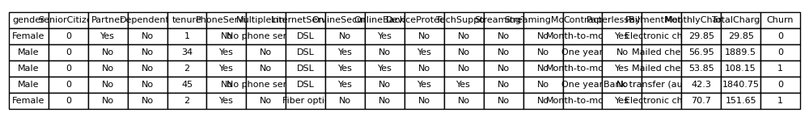
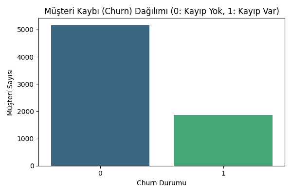
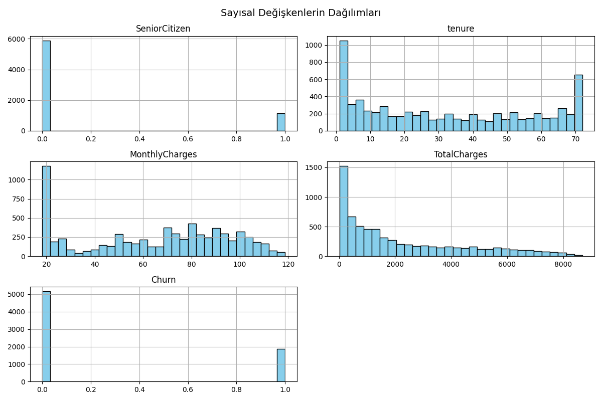
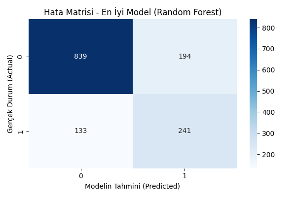

# Customer Churn Prediction

Bu proje, bir telekomünikasyon şirketinin müşteri kaybını (churn) tahmin etmek için veri bilimi süreçlerinin baştan sona uygulandığı bir örnektir. Proje, veri temizleme, keşifsel veri analizi (EDA), farklı makine öğrenmesi modelleriyle modelleme ve sonuçların değerlendirilmesi adımlarını kapsamaktadır.

## Proje Adımları

### 1. Veri Hazırlama ve Temizleme
- Ham veri dosyası (`churn_data.csv`) yüklendi.
- Gereksiz sütunlar (ör. `customerID`) kaldırıldı.
- Sayısal olması gereken sütunların veri tipleri düzeltildi (`TotalCharges`).
- Eksik veriler tespit edilip veri setinden çıkarıldı.
- Hedef değişken (`Churn`) sayısal forma dönüştürüldü (Yes=1, No=0).
- Temiz veri `cleaned_churn_data.csv` olarak kaydedildi.

**Temizlenmiş verinin ilk 5 satırı:**



---

### 2. Keşifsel Veri Analizi (EDA)
- Sütun isimleri, veri tipleri ve temel istatistikler incelendi.
- Hedef değişkenin (Churn) dağılımı analiz edildi.
- Kategorik ve sayısal değişkenlerin dağılımları görselleştirildi.

**Churn (Müşteri Kaybı) Dağılımı:**



**Sayısal Değişkenlerin Dağılımları:**



---

### 3. Modelleme ve Karşılaştırma
- Lojistik Regresyon, Random Forest ve Gradient Boosting modelleriyle eğitim yapıldı.
- Sayısal veriler ölçeklendirildi (StandardScaler).
- Modellerin doğruluk (accuracy) ve ROC-AUC skorları karşılaştırıldı.
- En iyi modelin hata matrisi ve sınıflandırma raporu sunuldu.

**En İyi Modelin Hata Matrisi:**



---

## Kullanılan Araçlar ve Kütüphaneler
- Python 3.12
- pandas, scikit-learn, matplotlib, seaborn

## Projeyi Çalıştırmak
1. Gerekli kütüphaneleri yükleyin:
   ```bash
   pip install -r requirements.txt
   ```
2. Veri hazırlama:
   ```bash
   python data_preparation.py
   ```
3. Keşifsel veri analizi:
   ```bash
   python data_overview.py
   ```
4. Model eğitimi ve değerlendirme:
   ```bash
   python model_train.py
   ```

## Notlar
- Proje adımları ve kodlar ayrıntılı yorumlarla açıklanmıştır.
- Görseller `assets/` klasöründe yer almaktadır. (Görselleri oluşturmak için kodları çalıştırabilirsiniz.)

---

Her türlü katkı ve öneriye açıktır!
