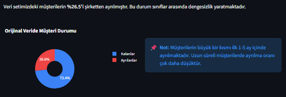
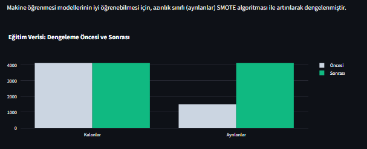
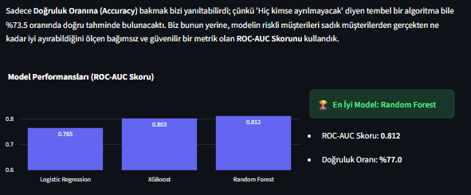
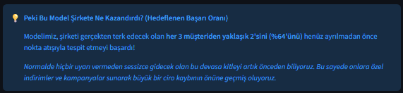
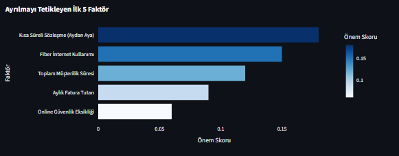

# 📉 Müşteri Kaybı (Customer Churn) Tahmini Projesi

Bu proje, bir telekomünikasyon şirketinin mevcut müşterilerinin ayrılma (churn) ihtimallerini makine öğrenmesi algoritmaları (Random Forest, XGBoost) kullanarak önceden tespit etmeyi amaçlayan uçtan uca bir veri bilimi çalışmasıdır. Proje boyunca verinin hazırlanmasından hiperparametre optimizasyonuna kadar olan süreçleri adım adım gerçekleştirdik. 

Aşağıda projeyi geliştirirken izlediğimiz adımları kısaca bulabilirsiniz.

---

## 🛠️ 1. Veri Hazırlığı ve Ön İşleme (Data Preprocessing)
Gerçek dünya verilerindeki eksik ve hatalı değerleri temizleyerek işe başladık. Modelin sonucuna etki etmeyecek olan `customerID` gibi değişkenleri veri setinden çıkardık ve kategorik (metinsel) verileri makine öğrenmesi modellerinin anlayabileceği sayısal formata getirdik.

<p align="center">
  
  <br><em>Temizlenmiş ve modele hazır hale getirilmiş veri setinden bir kesit.</em>
</p>

---

## ⚖️ 2. Sınıf Dengesizliği Sorunu ve SMOTE
Veri setinde ayrılan (Churn=1) müşterilerin sayısı, ayrılmayan (Churn=0) müşterilere kıyasla oldukça azınlıktaydı. Modellerin taraflı (hep ayrılmayacak yönünde) tahmin yapmasını engellemek için **SMOTE (Synthetic Minority Over-sampling Technique)** algoritmasını kullandık. Bu sayede azınlık sınıfı için sentetik veriler üretilerek sınıflar (eğitim verisinde) mükemmel bir dengeye ulaştırıldı.

<p align="center">
  
  <br><em>Sınıf dengesizliğinin SMOTE ile giderilmesi süreci.</em>
</p>

---

## 🤖 3. Modellerin Eğitilmesi ve Karşılaştırılması
Standardize edilmiş veriyi test ve eğitim olarak ikiye böldükktan sonra **Random Forest** ve **XGBoost** modellerini eğittik. En yüksek başarıyı elde edebilmek adına, modelleri kendi varsayılan ayarlarıyla bırakmayıp **GridSearchCV** ile yoğun bir hiperparametre taraması (ağaç derinliği, öğrenme katsayısı vb.) gerçekleştirdik.

<p align="center">
  
  <br><em>Optimizasyon sonrası farklı algoritmalar ile elde edilen başarı oranları.</em>
</p>

---

## 🏆 4. En İyi Modelin (Best Model) Seçimi
Hiperparametreleri optimize edilmiş algoritmalar arasından, özellikle yanlış tahminlerin maliyetine odaklanan ve dengesiz sınıflandırma problemlerinde kritik olan **ROC-AUC** skoruna göre şampiyon model seçildi. 

<p align="center">
  
  <br><em>ROC-AUC ve Accuracy sonuçlarına göre değerlendirilen nihai "Şampiyon Model".</em>
</p>

---

## 🔍 5. Ayrılmayı Ne Tetikliyor? (Feature Importance)
Oluşturduğumuz modelin matematiksel başarısı kadar "açıklanabilir" olması da (Interpretability) iş zekası adına bizim için kritikti. Modelimizin ağırlıklarına (Feature Importances) bakarak müşterileri "ayrılma" kararını almaya iten en belirleyici faktörleri belirledik. 

<p align="center">
  
  <br><em>Müşteri kaybını etkileyen en önemli (baskın) 15 faktör. Toplam ödeme tutarları, aylık masraflar ve müşterilik süresinin (tenure) kararı en çok etkileyen ana değişkenler olduğunu görüyoruz.</em>
</p>

---

## 🚀 Projeyi Çalıştırma

Projeyi yerel bilgisayarınızda derlemek isterseniz aşağıdaki adımları terminalinizde uygulayabilirsiniz.

```bash
# 1. Gerekli kütüphaneleri yükleyin
pip install pandas scikit-learn matplotlib seaborn imbalanced-learn xgboost joblib

# 2. Veri setini temizleyerek (.csv) modellemeye hazır matrisi oluşturun
python data_preparation.py

# 3. Model eğitimini, SMOTE ile çoğaltmayı ve GridSearchCV aramasını başlatın. 
# En iyi model pkl olarak diske kaydedilecektir.
python model_train.py
```